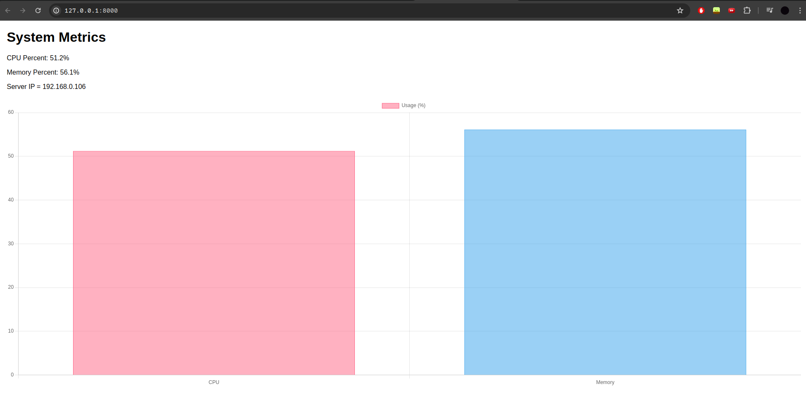
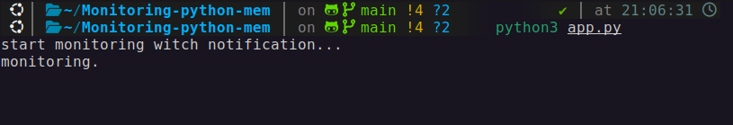

# Ultra mem monitoring web + app with on telegram chat

## WEB version

## CONSOLE version

## How alerts look like in telegram chat

в файле build.sh можете заменить параметры PORT на порт на котором вы хотите видеть сайт с контейнера.
и параметр SECOND_TO_TEST на то кол-во секунд, которые вы хотите видеть сайт живым.

микро мем на самом деле но работает.

вообще я увидел у чувака эту работу, но у него это выглядела как демка

а я добавил версию просто как процесс и добавил алерты в телеграмм, и переписал веб на fastapi с flaska.

